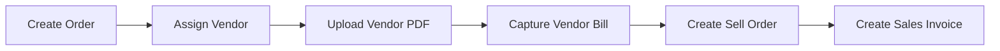
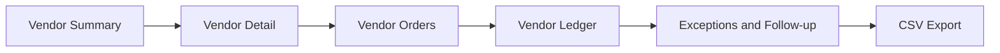
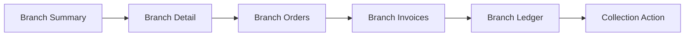
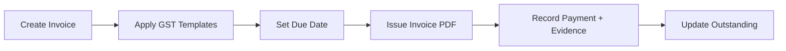
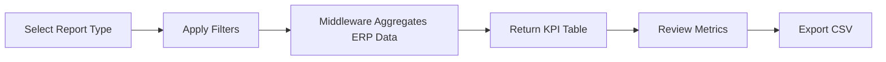

# AAS App Context + Core Flows (Text-Only)

Date: 2026-04-18

## App Context (as implemented)

- **Architecture:** Angular UI (`ui/`) calls Spring Boot middleware (`mw/`), and middleware is the only integration layer to ERPNext (`erpmodule/`).
- **System of record:** ERPNext doctypes are used directly (`Sales Order`, `Purchase Invoice`, `Sales Invoice`, `Payment Entry`) with AAS custom fields for workflow tracking.
- **Primary workflow state field:** `Sales Order.aas_status` driven by middleware state checks.

## Flow 1: Order Workflow

**What it does:** End-to-end order lifecycle from creation to invoicing.

## Flow 2: Vendor Operations

**What it does:** Vendor-centric monitoring across pending work, ledger, and exceptions.

## Flow 3: Branch Operations

**What it does:** Branch/customer-centric view for receivables and order pipeline health.

## Flow 4: Billing & Invoice

**What it does:** Creates invoices, applies tax templates, and records payment evidence-backed entries.

## Flow 5: Reporting

**What it does:** Middleware-generated aggregated analytics over ERPNext orders/invoices/payments.

## Notes

- This file intentionally avoids binary assets to stay PR-friendly in environments that block binary diffs.
- For ERPNext-alignment findings and risks, see `docs/erpnext-workflow-review.md`.
- If image export is still needed later, generate images locally from text/mermaid and attach them outside the git diff.
