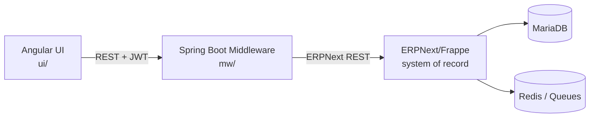
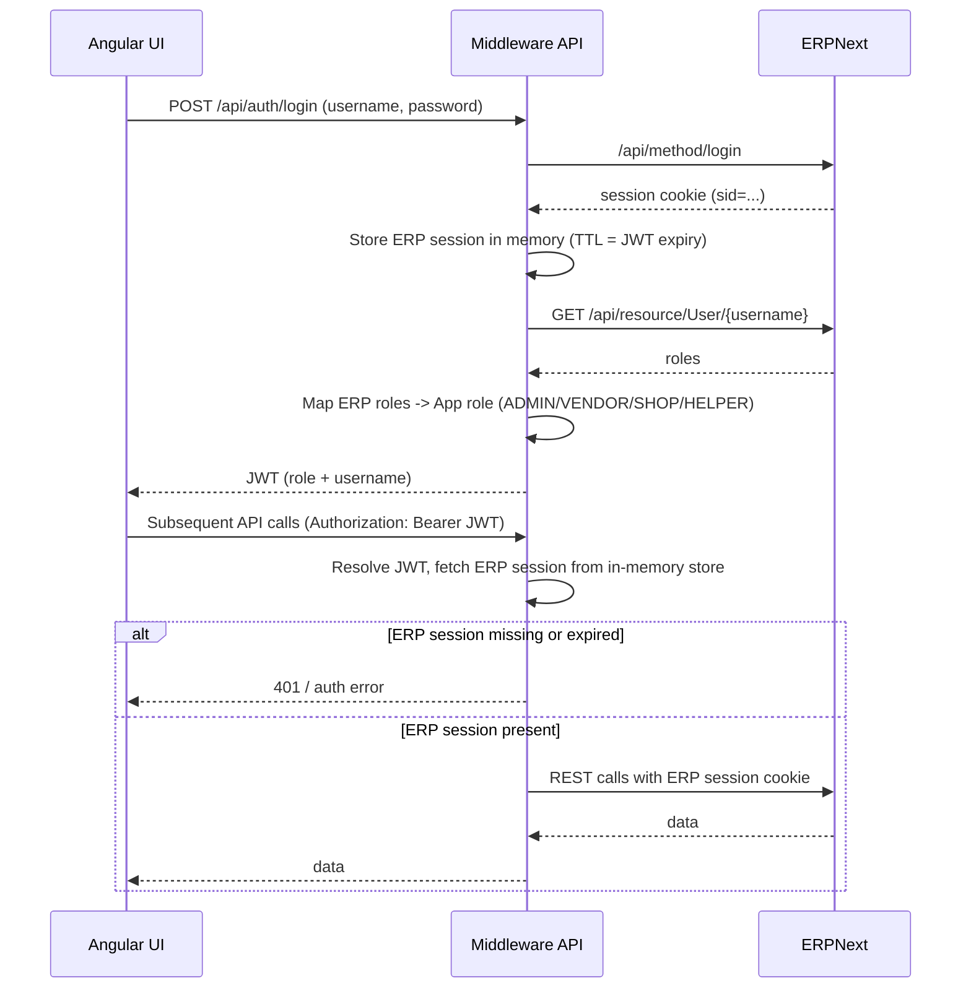

# AAS System Architecture Review (Code-Based)

Date: 2026-02-09

This document summarizes the **as-implemented architecture** based on code inspection of `mw/` (Spring Boot), `ui/` (Angular), and repository docs. It is intended as shared context for future agents.

## One-Page Summary

- The system is a three-tier stack: Angular UI (`ui/`) → Spring Boot middleware (`mw/`) → ERPNext/Frappe core (`erpmodule/`).
- The middleware is the **only** integration point for the UI. It exposes REST endpoints for auth, orders, invoices, payments, master data, reports, and setup.
- Authentication: UI gets a JWT from `POST /api/auth/login`. Middleware logs into ERPNext, stores the ERP session cookie in memory, and issues JWTs.
- ERPNext is the **system of record**. All CRUD and reporting data is fetched via ERPNext REST resources.
- Reports are computed in middleware by aggregating ERPNext data, not by a separate BI tool.
- Risks: ERP sessions are stored in memory (not multi-node safe). UI JWTs are in `localStorage` (XSS exposure).

## 1. High-Level Architecture (Verified in Code)

- **Client**: Angular app in `ui/`.
- **Middleware API**: Spring Boot in `mw/`.
- **ERP Core**: ERPNext/Frappe in `erpmodule/` (system of record), backed by MariaDB/Redis.

Data flow is strictly **UI → Middleware → ERPNext**. The UI never calls ERPNext directly.

## 2. UI Layer (Angular) Overview

- **Routing and Shell**: `ui/src/app/app.routes.ts`
  - Auth gate via `authGuard`.
  - Modules: Orders, Stock, Bills (invoices/payments), Vendors, Branches, Categories, Items, Dashboard, Reports placeholder.
- **Auth token storage**: `ui/src/app/shared/auth-token.service.ts`
  - JWT stored in `localStorage` as `aas_auth_token`.
- **API usage**: Services call middleware endpoints with `Authorization: Bearer <token>`.
  - Example: `ui/src/app/orders/order.service.ts`, `ui/src/app/bills/bills.service.ts`, `ui/src/app/vendors/vendor.service.ts`.

## 3. Middleware API Layer (Spring Boot)

### Controllers and API Surface

- Auth: `POST /api/auth/login` (`mw/src/main/java/com/aas/mw/controller/AuthController.java`)
- Profile: `GET /api/me` (`mw/src/main/java/com/aas/mw/controller/MeController.java`)
- Orders:
  - `POST /api/orders`
  - `GET /api/orders`, `GET /api/orders/{id}`
  - `PUT /api/orders/{id}`
  - `POST /api/orders/{id}/status`
  - `POST /api/orders/{id}/assign-vendor`
  - `GET /api/orders/export`
  (`mw/src/main/java/com/aas/mw/controller/OrdersController.java`, `VendorAssignmentController.java`)
- Invoices:
  - `POST /api/invoices`
  - `GET /api/invoices`
  - `GET /api/invoices/export`
  - `GET /api/invoices/{id}/pdf`
  (`mw/src/main/java/com/aas/mw/controller/InvoiceController.java`)
- Payments: `POST /api/payments` (`mw/src/main/java/com/aas/mw/controller/PaymentsController.java`)
- Master data:
  - `GET /api/items`, `POST /api/items`
  - `GET /api/vendors`, `POST /api/vendors`
  - `GET /api/categories`, `POST /api/categories`
  - `GET /api/shops`, `POST /api/shops`
  (`mw/src/main/java/com/aas/mw/controller/MasterDataController.java`)
- Reports: `/api/reports/*` with CSV export variants
  (`mw/src/main/java/com/aas/mw/controller/ReportsController.java`)
- Setup: `POST /api/setup/ensure`
  (`mw/src/main/java/com/aas/mw/controller/SetupController.java`)

### Security and Auth Flow

- **JWT-based stateless auth** enforced in `mw/src/main/java/com/aas/mw/config/SecurityConfig.java`.
- **Login flow** (`AuthenticationService`):
  1. Middleware logs in to ERPNext with username/password.
  2. Extracts ERPNext session cookie.
  3. Resolves ERP role → App role.
  4. Generates JWT (subject = username, role = app role).
  5. Stores ERPNext session cookie in an in-memory store.

Key files:
- `mw/src/main/java/com/aas/mw/service/AuthenticationService.java`
- `mw/src/main/java/com/aas/mw/service/ErpSessionStore.java`
- `mw/src/main/java/com/aas/mw/config/JwtAuthenticationFilter.java`

### ERPNext Integration

- **Client wrapper**: `mw/src/main/java/com/aas/mw/client/ErpNextClient.java`
- **Feign interface**: `mw/src/main/java/com/aas/mw/client/ErpNextFeignClient.java`
- All domain services call ERPNext via the client and normalize responses.

### Role And Endpoint Access (Enforced In SecurityConfig)

Endpoint access is enforced in `mw/src/main/java/com/aas/mw/config/SecurityConfig.java`. Key rules:
- `POST /api/auth/login`, Swagger docs: public.
- `POST /api/setup/**`: ADMIN only.
- `POST /api/vendors`, `POST /api/shops`: ADMIN only.
- `POST /api/categories`, `POST /api/items`: ADMIN or HELPER.
- `POST /api/orders`: ADMIN or SHOP.
- `POST /api/orders/*/assign-vendor`: ADMIN only.
- `POST /api/orders/*/status`: ADMIN, VENDOR, or HELPER.
- `POST /api/invoices`: ADMIN only.
- `POST /api/payments`: ADMIN or SHOP.
- `GET /api/orders`, `/api/orders/export`: ADMIN, VENDOR, SHOP, HELPER.
- `GET /api/invoices/**`, `/api/invoices/export`: ADMIN or SHOP.
- `/api/reports/**`: ADMIN, VENDOR, SHOP.

## 4. ERP DocType Mapping (Code-Observed)

This is the actual mapping of middleware services to ERPNext DocTypes.

- Orders: `Sales Order` (`OrderService`)
- Order items: `Sales Order Item` (used for cost/margin calculations)
- Invoices: `Sales Invoice` (`InvoiceService`)
- Payments: `Payment Entry` (`ReportService` for reporting; `PaymentService` for creation)
- Items: `Item` (`MasterDataService`)
- Categories: `Item Group` (`MasterDataService`)
- Vendors: `Supplier` (`MasterDataService`)
- Shops: `Customer` (`MasterDataService`)
- Users: `User` (`UserService`, `AuthenticationService`)
- Custom fields: `Custom Field` (`SetupService`)

## 5. Setup / Provisioning Behavior

`POST /api/setup/ensure` provisions ERPNext custom fields and optional default users.

Custom fields created (if missing):
- `Sales Order`: `aas_vendor` (Link to Supplier), `aas_status` (Select)
- `Item`: `aas_margin_percent`, `aas_vendor_rate`
- `Sales Order Item`: `aas_margin_percent`, `aas_vendor_rate`

Default users (if enabled via config):
- Vendor user (role: Supplier)
- Shop user (role: Customer)
- Helper user (role: Stock User)

See `mw/src/main/java/com/aas/mw/service/SetupService.java`.

## 6. Reporting Computation (Middleware)

Reports are computed in middleware by fetching ERPNext data and aggregating:
- Vendor orders by shop
- Vendor billing
- Vendor payments
- Shop billing
- Shop payments
- Shop category spend

These endpoints use `Sales Order` and `Payment Entry` data and compute totals, costs, and margins in Java:
`mw/src/main/java/com/aas/mw/service/ReportService.java`.

## 7. Operational Considerations / Failure Modes

- **ERP session storage** is in-memory only (`ErpSessionStore`), so multi-node middleware deployments will not share ERP sessions. A restart logs everyone out.
- **JWT in localStorage** is convenient but vulnerable to XSS. Consider HttpOnly cookies for production.
- **Reporting overhead** can be high: reports fetch lists of orders and then fetch each order detail to compute costs.
- **ERP availability** is a hard dependency; middleware is a thin facade and cannot operate without ERPNext.

## 8. Observed Data Flow By Feature

- Orders: UI → `/api/orders` → ERPNext `Sales Order`.
- Invoices: UI → `/api/invoices` → ERPNext `Sales Invoice`.
- Payments: UI → `/api/payments` → ERPNext `Payment Entry`.
- Vendors/Shops/Categories/Items: UI → `/api/*` → ERPNext `Supplier/Customer/Item Group/Item`.
- Reports: UI → `/api/reports/*` → ERPNext `Sales Order` + `Payment Entry` + computed metrics.

## 9. ERP Core (ERPNext/Frappe)

- ERPNext is the **system of record**.
- Middleware uses ERPNext REST resources for all CRUD and reporting.
- ERPNext custom fields and default users can be provisioned via `POST /api/setup/ensure` (`SetupService`).

## 10. Not Present (Confirmed By Repo)

Legacy/previous architecture items are not present in this codebase:
- Directus middleware
- React frontend
- Metabase/Power BI
- Separate Postgres/MySQL data stores

## 11. Runtime / Dev

- Angular dev server (`ui/`) → middleware proxy at `/api`.
- Spring Boot middleware runs on port 8083 (per `SYSTEM_DESIGN.md`).
- ERPNext runs under Docker Compose in `erpmodule/`.

---

If you need a deeper audit (e.g., exact field usage per endpoint, data model mappings, or performance risks in reporting), extend this doc with code references and profiling notes.

## 12. Usage Guide For Agents

Use this document as the first stop for architecture context before reading code.

Recommended flow:
1. Read this doc to understand system boundaries and verified behavior.
2. Use the listed file references to jump directly to implementation details.
3. When making changes, update this doc to keep it authoritative.
4. If behavior diverges from this doc, treat code as source of truth and update the doc.

This is meant to prevent repeated rediscovery and keep architectural context consistent across sessions.
